# 第5章代码

## 图形


```python
import math
import numpy as np
import pandas as pd
import matplotlib.pyplot as plt
plt.rcParams['font.sans-serif']=['SimSun']

x=np.linspace(-4*math.pi,4*math.pi,101)

plt.plot(x,np.sin(x))
plt.plot(x,np.cos(x))
plt.plot(x,np.log(x))
plt.text(6,-30,'$y=\log(x)+\sum_{i=1}^n x_i$')
```

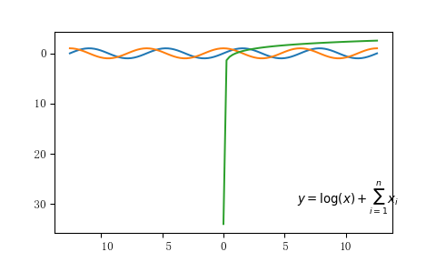


```python
BSdata=pd.read_csv("./data/BSdata.csv")
plt.scatter(BSdata.身高,BSdata.体重,s=BSdata.支出)
```

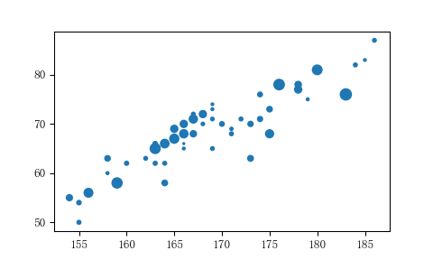

## 三维曲面

```python
from mpl_toolkits.mplot3d import Axes3D

x=y=np.linspace(-4,4,21)
X,Y=np.meshgrid(x,y)
Z=np.sqrt(X**2+Y**2)

fig1=plt.figure()
ax1=Axes3D(fig1)
ax1.plot_surface(X,Y,Z)

fig2=plt.figure()
ax2=Axes3D(fig2)
ax2.scatter(X,Y,Z)

fig3=plt.figure()
ax3=Axes3D(fig3)
ax3.scatter(BSdata.身高,BSdata.体重,s=50*np.random.rand(1))
```

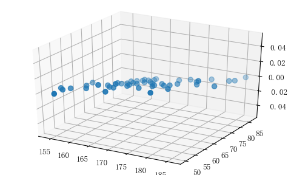

## seaborn作图

```python
import seaborn as sns
```
### 箱线图（boxplot）

```python
sns.boxplot(BSdata.身高)
```

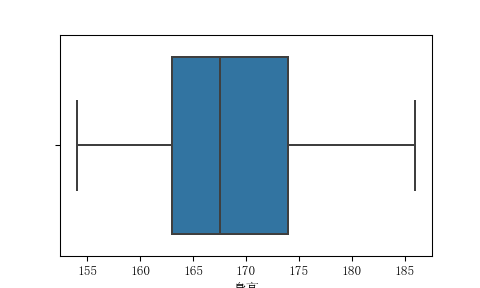

```python
plt.boxplot(BSdata.身高)
```

```python
sns.boxplot(y=BSdata.身高)
```

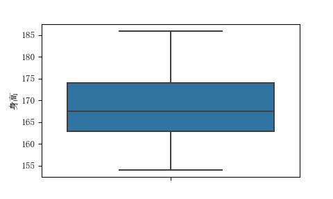

```python
sns.boxplot(x=BSdata.性别,y=BSdata.身高)
```

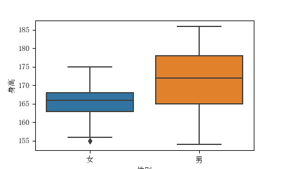

```python
sns.boxplot(y=BSdata.开设,x=BSdata.支出,hue=BSdata.性别)
plt.text(80,1,r'$\bar x$')
```

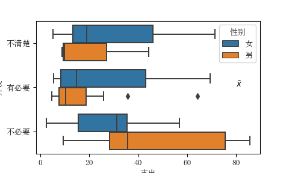

### 小提琴图（xiolinplot）

```python
sns.violinplot(x='性别',y='身高',data=BSdata)
```

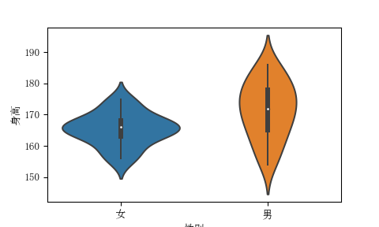

```python
sns.violinplot(x='开设', y='支出',hue='性别',data=BSdata)
```

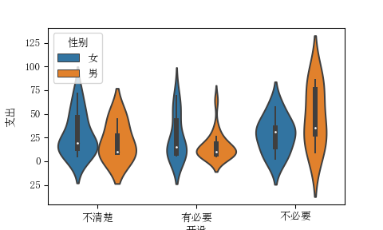
### 点图（stripplot）

```python
sns.stripplot(x='性别', y='身高',data=BSdata)
```

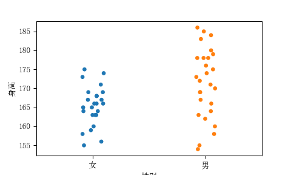

```python
sns.stripplot(x='性别', y='身高',data=BSdata,jitter=True)
```

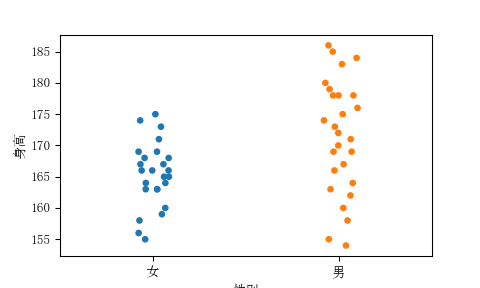

```python
sns.stripplot(y='性别', x='身高',data=BSdata,jitter=True)
```

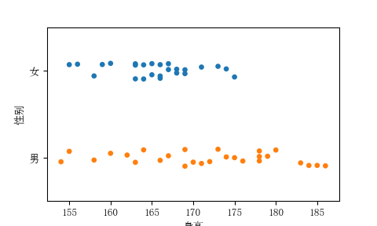

### 条图（barplot）

```python
sns.barplot(x='性别', y='身高',data=BSdata,ci=0,palette="Blues_d")
```

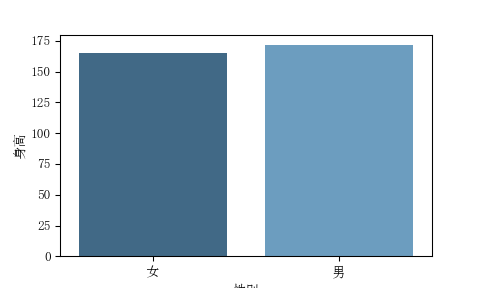

### 计数图（countplot）

```python
sns.countplot(x='性别',data=BSdata)
```

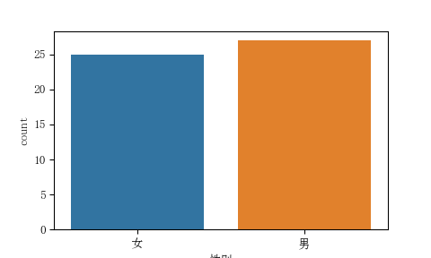

```python
sns.countplot(y='开设',data=BSdata)
```

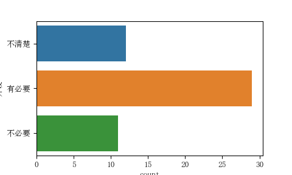

```python
sns.countplot(x='性别',hue='开设',data=BSdata)
```

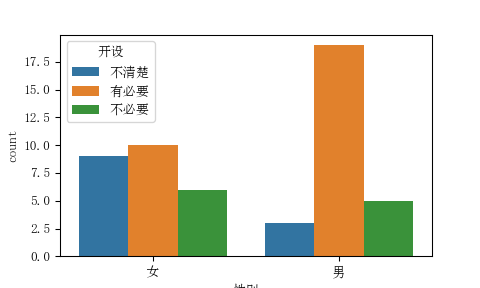

### 分组关系图（catplot）

```python
sns.catplot(x='性别',col='开设', col_wrap=3,data=BSdata,kind='count',height=2.5, aspect=.8)
```

```python
sns.distplot(BSdata['身高'],kde=True,bins=20,rug=True)
```

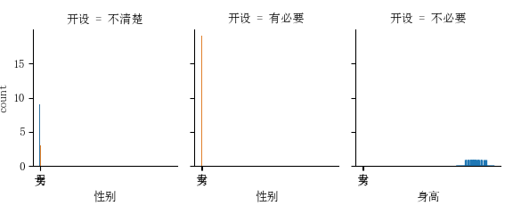

```python
sns.jointplot(x='身高', y='体重', data=BSdata)
```

```python
sns.pairplot(BSdata[['身高','体重','支出']])
```

## 公式
样本均值$\bar x$的计算公式为：
$$\bar x=\frac{1}{n}\sum_i^n x_i$$
$\alpha$


# 参考文献
[//]: # (\bibliography{Bibfile})
