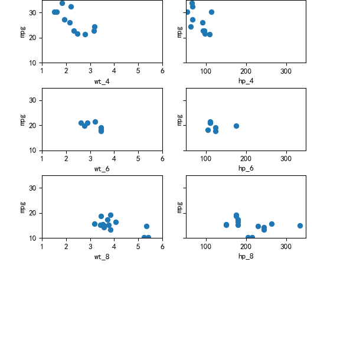
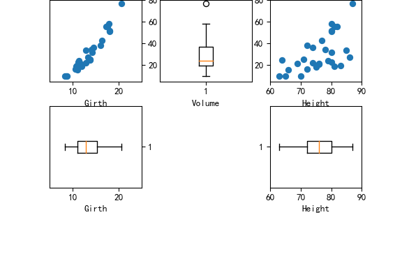
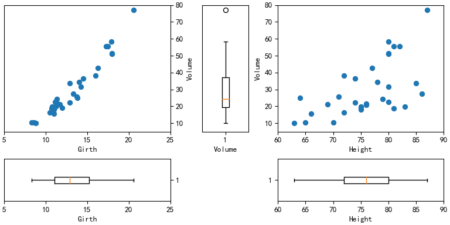
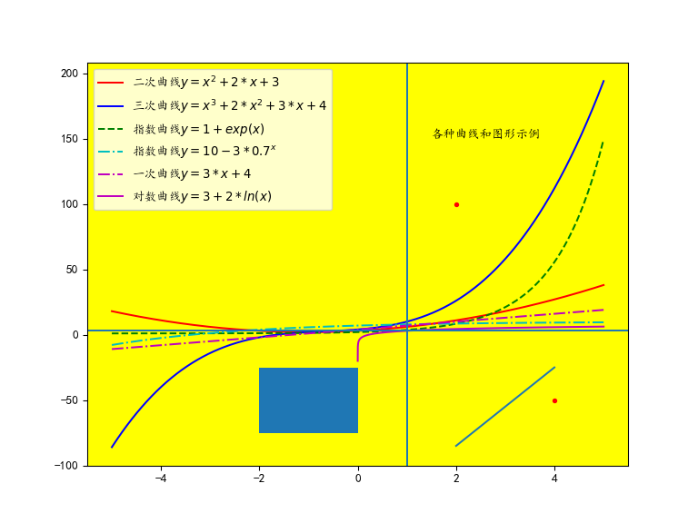
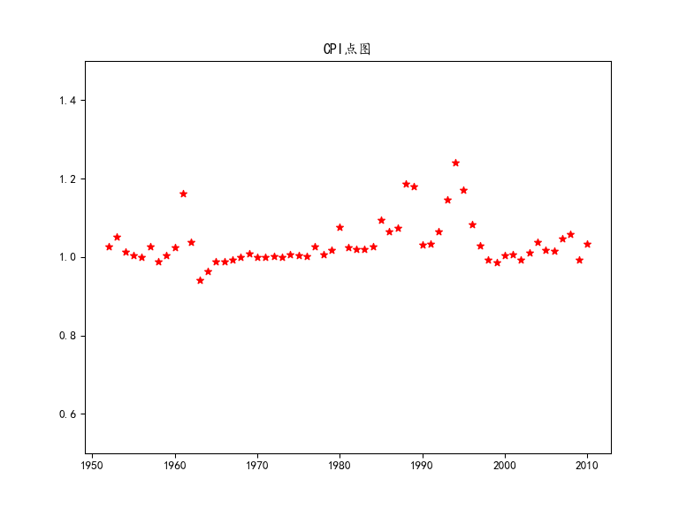
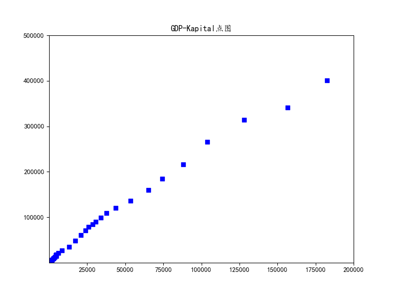
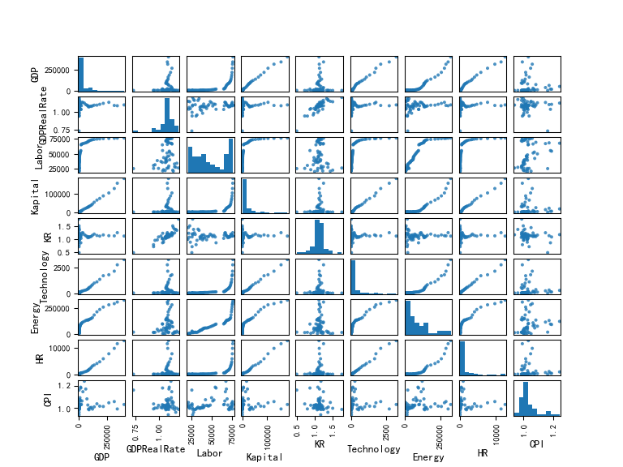

# 利用mtcars数据集
使用图形参数的方法作一个包含3行2列的面板图，要求第一列包含4、6、8缸汽车的mpg-wt的散点图，第二列包含包含4、6、8缸汽车的mpg~hp的散点图, 并对子图形的坐标轴范围、标签、边距等进行设置。

导入模块

```python
import pandas as pd
import numpy as np
import matplotlib.pyplot as plt
import matplotlib.patches as patches
plt.rcParams['font.sans-serif']=['KaiTi']
plt.rcParams['axes.unicode_minus']=False
```

读取数据集

```python
mtcars=pd.read_csv("./data/mtcars.csv")

cyl4=mtcars[mtcars.cyl==4]
cyl6=mtcars[mtcars.cyl==6]
cyl8=mtcars[mtcars.cyl==8]
```

作图

```python
fig,ax=plt.subplots(3,2,sharey=True,figsize=(6,6)) #保持y轴相同
plt.ylim(10,35) #设置y轴范围
```

```python
plt.subplots_adjust(left=0.124,bottom=0.3,right=0.9,top=1,wspace=0.2,hspace=0.4) # 调整子图边距、间距

ax[0,0].scatter(cyl4.wt,cyl4.mpg)
ax[0,0].set_xlim(1,6)
```

```python
ax[0,0].set_ylabel("mpg")
ax[0,0].set_xlabel("wt_4")

ax[1,0].scatter(cyl6.wt,cyl6.mpg)
ax[1,0].set_xlim(1,6)
```

```python
ax[1,0].set_ylabel("mpg")
ax[1,0].set_xlabel("wt_6")

ax[2,0].scatter(cyl8.wt,cyl8.mpg)
ax[2,0].set_xlim(1,6)
```

```python
ax[2,0].set_ylabel("mpg")
ax[2,0].set_xlabel("wt_8")

ax[0,1].scatter(cyl4.hp,cyl4.mpg)
ax[0,1].set_xlim(50,350)
```

```python
ax[0,1].set_ylabel("mpg")
ax[0,1].set_xlabel("hp_4")

ax[1,1].scatter(cyl6.hp,cyl6.mpg)
ax[1,1].set_xlim(50,350)
```

```python
ax[1,1].set_ylabel("mpg")
ax[1,1].set_xlabel("hp_6")

ax[2,1].scatter(cyl8.hp,cyl8.mpg)
ax[2,1].set_xlim(50,350)
```

```python
ax[2,1].set_ylabel("mpg")
ax[2,1].set_xlabel("hp_8")
```



# 利用trees 数据集，完成面板图，要求：
1. 作 Volume~Girth 的散点图，要求y轴在右边，在图像下方给出Girth的箱线图
2. 作 Volume~Height 的散点图，要求y轴在左边，在图像下方给出Height的箱线图
3. 在两个散点图中间给出 Volume 的箱线图
4. 对子图形的坐标轴范围、标签、边距等进行设置


```python
# 读入数据
trees=pd.read_csv('./data/trees.csv')

# 作图
## 左侧Volume~Girth图
plt.figure(figsize=(6,4))
plt.subplots_adjust(left=0.124,bottom=0.3,right=0.9,top=1,wspace=0.2,hspace=0.3)

plt.subplot(231);plt.scatter(trees.Girth,trees.Volume)
plt.ylim(5,80)
```

```python
plt.xlim(5,25)
```

```python
plt.xlabel('Girth')
plt.ylabel('Volume')
axis=plt.gca() #获取当前图像坐标轴
axis.yaxis.set_ticks_position('right') #y轴刻度置于右侧
axis.yaxis.set_label_position('right') #y轴标签置于右侧

plt.subplot(234);plt.boxplot(trees.Girth,vert=False) #横向箱线图
```

```python
plt.xlim(5,25)
```

```python
plt.xlabel('Girth')
axis=plt.gca()
axis.yaxis.set_ticks_position('right')

## 右侧Volume~Height图
plt.subplot(233);plt.scatter(trees.Height,trees.Volume)
plt.ylim(5,80)
```

```python
plt.xlim(60,90)
```

```python
plt.xlabel('Height')
plt.ylabel('Volume')

plt.subplot(236);plt.boxplot(trees.Height,vert=False)
```

```python
plt.xlim(60,90)
```

```python
plt.xlabel('Height')

## 中间Volume箱线图
plt.subplot(232);plt.boxplot(trees.Volume)
```

```python
plt.ylim(5,80)
```

```python
plt.yticks([]) #隐藏当前图像y轴
```

```python
plt.xlabel('Volume')
plt.show()
```



修改后

```python
fig4=plt.figure(constrained_layout=True,figsize=(8,4))
gs=fig4.add_gridspec(4,5)

f4_ax1=fig4.add_subplot(gs[:-1,0:2])
plt.scatter(trees.Girth,trees.Volume)
plt.ylim(5,80)
```

```python
plt.xlim(5,25)
```

```python
plt.xlabel('Girth')
plt.ylabel('Volume')
axis=plt.gca()
axis.yaxis.set_ticks_position('right')
axis.yaxis.set_label_position('right')

f4_ax2=fig4.add_subplot(gs[:-1,2])
plt.boxplot(trees.Volume)
```

```python
plt.ylim(5,80)
```

```python
plt.yticks([])
```

```python
plt.xlabel('Volume')

f4_ax3=fig4.add_subplot(gs[:-1,3:])
plt.scatter(trees.Height,trees.Volume)
plt.ylim(5,80)
```

```python
plt.xlim(60,90)
```

```python
plt.xlabel('Height')
plt.ylabel('Volume')

f4_ax4=fig4.add_subplot(gs[-1,0:2])
plt.boxplot(trees.Girth,vert=False) #横向箱线图
```

```python
plt.xlim(5,25)
```

```python
plt.xlabel('Girth')
axis=plt.gca()
axis.yaxis.set_ticks_position('right')

f4_ax5=fig4.add_subplot(gs[-1,3:])
plt.boxplot(trees.Height,vert=False)
```

```python
plt.xlim(60,90)
```

```python
plt.xlabel('Height')
plt.show()
```




# 在同一个图形中画出以下函数的曲线：
1. $y=x^2+2*x+3$
2. $y=x^3+2*x^2+3*x+4$
3. $y=3+2*ln(x)$
4. $y=1+exp(x)$
5. $y=10-3*0.7^x$
6. $y=3*x+4$
(对以上线型添加latex公式图例)
7. $y=3$
8. $x=1$
9.  要求设置为不同的线型和颜色
10. 添加曲线的图例(二次曲线，三次曲线，对数曲线等)
11. 在图形中添加 两个点， 一条线段，一个矩形，一个说明文字
12. 把整个图形的背景设置为黄色


```python
# 画出曲线
fig = plt.figure(figsize=(8,6))
ax = fig.add_subplot(111)

x=np.linspace(-5,5,1001)
plt.plot(x,x**2+2*x+3,'r-',label='二次曲线$y=x^2+2*x+3$')
plt.plot(x,x**3+2*x**2+3*x+4,'b-',label='三次曲线$y=x^3+2*x^2+3*x+4$')
plt.plot(x,1+np.exp(x),'g--',label='指数曲线$y=1+exp(x)$')
plt.plot(x,10-3*0.7**x,'c-.',label='指数曲线$y=10-3*0.7^x$')
plt.plot(x,3*x+4,'m-.',label='一次曲线$y=3*x+4$')

x=np.linspace(0,5,500000)[1:]
plt.plot(x,3+2*np.log(x),'m-',label='对数曲线$y=3+2*ln(x)$')  #log默认e为底

plt.axhline(3)
plt.axvline(1)

# 添加图例
plt.legend(loc='upper left')
# 添加两点
a=[4,2]
b=[-50,100]
plt.plot(a,b, '.r')

# 添加线段
c=[2,4]
d=[-85,-25]
plt.plot(c,d)

# 添加矩形
ax.add_patch(patches.Rectangle((-2, -75), 2, 50))

# 添加说明文字
plt.text(1.5,150,'各种曲线和图形示例')

# 图形背景设置为黄色
ax.set_facecolor('yellow')
plt.show()
```



# 导入GDP数据集，分别作：
1. CPI向量的点图
2. 以Kapital为自变量，GDP为因变量，作它们的散点图
3. 作GDP数据集的散点图矩阵
4. 根据需要设置以上图形的点型，颜色，坐标轴范围，标题等选项

读入数据

```python
GDP=pd.read_csv('./data/GDP.csv')
```
作图

```python
## CPI点图
plt.scatter(GDP.Year,GDP.CPI,c='r',marker='*')
plt.ylim(0.5,1.5)
```

```python
plt.title('CPI点图')
plt.show()
```



```python
## GDP-Kapital图
plt.scatter(GDP.Kapital,GDP.GDP,c='b',marker='s')
plt.ylim(500,500000)
```

```python
plt.xlim(50,200000)
```

```python
plt.title('GDP-Kapital点图')
plt.show()
```



```python
## 散点图矩阵
del GDP['Year']
pd.plotting.scatter_matrix(GDP,alpha=0.8,figsize=(8,6),diagonal='hist',marker='.')
```

```python
plt.subplots_adjust(left=None,bottom=None,right=None,top=None,wspace=0.15,hspace=0.15)
plt.show()
```



# 参考文献
[//]: # (\bibliography{Bibfile})
